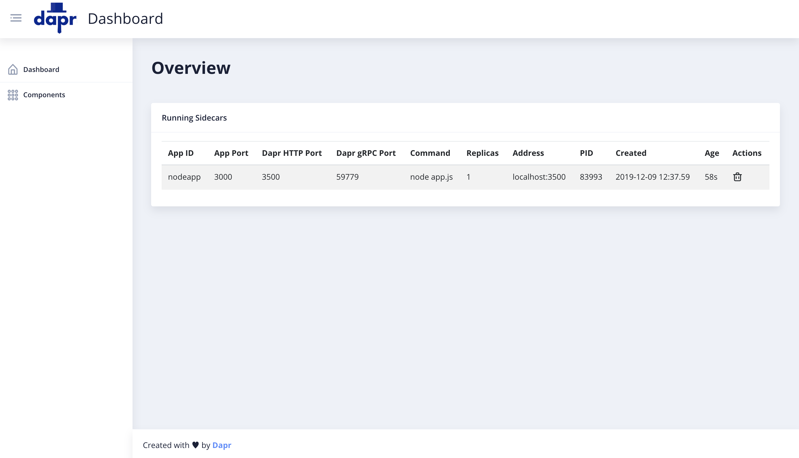

# Dapr Dashboard

The Dapr Dashboard is a web-based UI for Dapr, allowing users to see information, view logs and more for the Dapr sidecars running either locally or in a Kubernetes cluster.

<p style="text-align:center">
  
</p>

## Features

This repo is under heavy development, all devs and web developers in particular are welcome to start contributing!

* List Dapr sidecars with metadata (Self hosted, Kubernetes)
* Stop a running sidecar (Self hosted)
* View sidecar logs (Kubernetes)
* View components in the cluster (Kubernetes, coming soon)

## Getting started

### Local machine

Running the dashboard locally will work with Dapr instances running on the local machine.

First, make sure you have [Go](https://golang.org/dl/) installed.
Go > 1.13 is required.

Install the Angular CLI:

```
npm i @angular/cli
```

Clone the repo and run the dashboard:

```
mkdir -p $GOPATH/src/github.com/dapr/dashboard
cd $GOPATH/src/github.com/dapr
git clone git@github.com:dapr/dashboard.git
cd dashboard/web
npm i
ng build
cd ..
go build
./dashboard
```

Done! point your browser to http://localhost:8080.

### Kubernetes

Running the dashboard in Kubernetes will let you view and manage the the Dapr instances running in your cluster.

1. Deploy the dashboard:

```
kubectl apply -f https://raw.githubusercontent.com/dapr/dashboard/master/deploy/dashboard.yaml
```

Wait until the dashboard pod is in Running state:

```
kubectl get pod --selector=app=dapr-dashboard -w
```

2. Connect to the dashboard:

```
kubectl port-forward svc/dapr-dashboard 8080:8080
```

Done! point your browser to http://localhost:8080.

## Building from source

First, install the Angular CLI:

```
npm i @angular/cli
```

Build the website and the Go web server into the `/release` dir:

```
./buid.sh
```

### Building a Docker image

After you have the release dir in place, run:

```
docker build -t <image>:<tag> .
docker push <image>:<tag>
```
