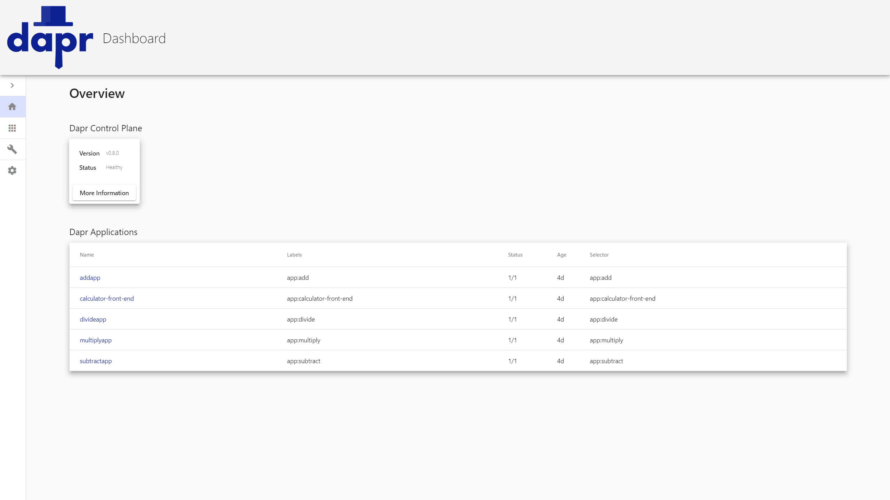

# Dapr Dashboard

[](https://codecov.io/gh/dapr/dashboard)
[](https://app.fossa.com/projects/custom%2B162%2Fgithub.com%2Fdapr%2Fdashboard?ref=badge_shield)

Dapr Dashboard is a web-based UI for Dapr, allowing users to see information, view logs and more for the Dapr applications, components, and configurations running on a supported Dapr Dashboard platform.

Supported Dapr Dashboard plaforms are:
- Standalone - running locally via Dapr CLI
- Kubernetes - running inside a Kubernetes cluster
- Docker Compose - running inside a docker compose network

<p style="text-align:center">
  
</p>

## Features

Dapr Dashboard provides information about Dapr applications, components, configurations, and control plane services (Kubernetes only). Users can view metadata, manifests and deployment files, actors, logs, and more. For more information, check out the [changelog](docs/development/changelog.md).

## Getting started

### Prerequisites

If you intend to run in the Standalone or Kubernetes platform mode you will need to have the following:

- [Dapr Runtime](https://github.com/dapr/dapr)
- [Dapr CLI](https://github.com/dapr/cli)

Dapr Dashboard comes pre-packaged with the Dapr CLI. To learn more about the dashboard command, use the CLI command `dapr dashboard -h`.

If you intend to run in the Docker Compose platform mode, you don't need to install anything. Instead you specify Dapr docker images to use.

### Installation

#### Kubernetes
Run `dapr dashboard -k`, or if you installed Dapr in a non-default namespace, `dapr dashboard -k -n <your-namespace>`.

#### Standalone
Run `dapr dashboard`, and navigate to http://localhost:8080.

#### Docker Compose
Construct a docker compose file that references the specific Dapr pieces that you want to use. The following example defines an application and its corresponding daprd sidecar, the Dapr Placement service, and the Dapr Dashboard.

When running inside docker compose, the dashboard needs access to the component and configuration files that are passed to the daprd services. It also needs to know about all daprd services running inside the docker compose network - it retrieves this by parsing the docker-compose.yml file. To achieve this, you define docker bind mounts to these files/directories and pass them as command args to the dashboard process. In addition, you must specify the command arg `--docker-compose=true` to tell the dashboard to use the docker compose platform type.

```yml
version: '3.8'
services:
      
  my-application-webhost:
    build:
      context: .
      dockerfile: src/My.Application.WebHost/Dockerfile   
    ports:
      - "5002:80"
    networks:
      - my-network

  my-application-webhost-dapr:
    image: "daprio/daprd:1.8.0"
    command: [ "./daprd",
               "-app-id", "MyApplication.DaprSidecar",
               "-app-port", "80",
               "-placement-host-address", "dapr-placement:50000",
               "-components-path", "/components",
               "-config", "/configuration/config.yaml" ]
    volumes:
      - "./dockercompose/dapr/components/:/components"
      - "./dockercompose/dapr/config/:/configuration"
    depends_on:
      - my-application-webhost
      - dapr-placement
    network_mode: "service:my-application-webhost" 
        
  dapr-placement:
    image: "daprio/dapr:1.8.0"
    command: [ "./placement", "-port", "50000" ]
    ports:
      - "50000:50000"
    networks:
      - my-network

  dapr-dashboard:
    image: "daprio/dashboard:latest"
    command: [ "--docker-compose=true", 
      "--components-path=/home/nonroot/components", 
      "--config-path=/home/nonroot/configuration", 
      "--docker-compose-path=/home/nonroot/docker-compose.yml" ]
    ports:
      - "8080:8080"
    volumes:
      - "./dockercompose/dapr/components/:/home/nonroot/components"
      - "./dockercompose/dapr/config/:/home/nonroot/configuration"
      - ./docker-compose.yml:/home/nonroot/docker-compose.yml
    networks:
      - my-network
      
networks:
  my-network:
```

The above example assumes the following file system layout

```
dockercompose
  dapr
    components
      (component yaml files e.g. pubsub.yaml, statestore.yaml etc.)
    config
      config.yaml
src
  My.Application.WebHost
    Dockerfile
docker-compose.yml
```

If you have configured your Dapr sidecars to require [API token authentication](https://docs.dapr.io/operations/security/api-token/), you can set the environment variable `DAPR_API_TOKEN: {your token}` on the Dapr Dashboard service declaration as follows
```yml
  dapr-dashboard:
    image: "daprio/dashboard:latest"
    environment:
      DAPR_API_TOKEN:  {your token}
    ...
```

For more information about running Dapr with docker compose see [Run using Docker-Compose](https://docs.dapr.io/operations/hosting/self-hosted/self-hosted-with-docker/#run-using-docker-compose)

### Contributing
Anyone is free to open an issue, a feature request, or a pull request.

To get started in contributing, check out the [development documentation](docs/development/development_guide.md).
